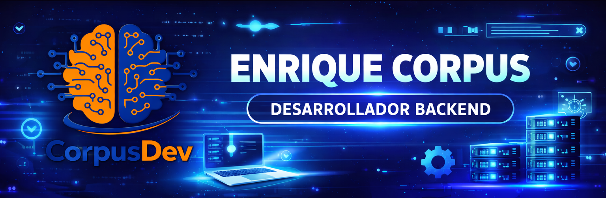

  

  

## 👨‍💻 Sobre Mí

Soy un desarrollador en formación con pasión por transformar ideas creativas en soluciones tecnológicas funcionales. Mi enfoque combina **lógica**, **estrategia** y **creatividad** para construir aplicaciones web interactivas y eficientes.

- 🔭 Actualmente trabajando en proyectos con **Java** y **SpringBoot**
- 🌱 Aprendiendo constantemente nuevas tecnologías del ecosistema web
- 💡 Interesado en desarrollo full stack y arquitectura de software
- 🎯 Objetivo: Convertirme en un desarrollador senior especializado en tecnologías modernas

---
## 🛠️ Stack Tecnológico

### Lenguajes & Frameworks

  

### Bases de Datos

  

### Herramientas & Plataformas

  

---

## Proyectos Destacados

<table>
  <tr>
    <td align="center">
      
<strong>Juego de Poker</strong>

      
       
      
    </td>
    <td align="center">
      
<strong>Buscador de Pokemones</strong>

      
       
      
    </td>
  </tr>
</table>

### 💼 Enfoque de Desarrollo

Estos proyectos reflejan mi compromiso con el aprendizaje continuo y la aplicación práctica de conceptos fundamentales:

- 🎯 **Lógica de Programación:** Resolución de problemas complejos con código limpio y eficiente
- 🔄 **Consumo de APIs:** Integración de servicios externos y manejo de datos asíncronos
- 🎨 **Manipulación del DOM:** Creación de experiencias interactivas y dinámicas
- 📊 **Estructuras de Datos:** Uso efectivo de arrays, objetos y funciones
- 🖼️ **Interfaces de Usuario:** Diseño responsive y centrado en la experiencia del usuario

---

## 📊 Estadísticas de GitHub

  
  
  
  
  
  

## 🤝 Conectemos

Estoy siempre abierto a colaborar en proyectos interesantes, compartir conocimientos y conectar con otros desarrolladores.

**¿Tienes una idea? ¡Hablemos!**

---
# kikecorpus1
